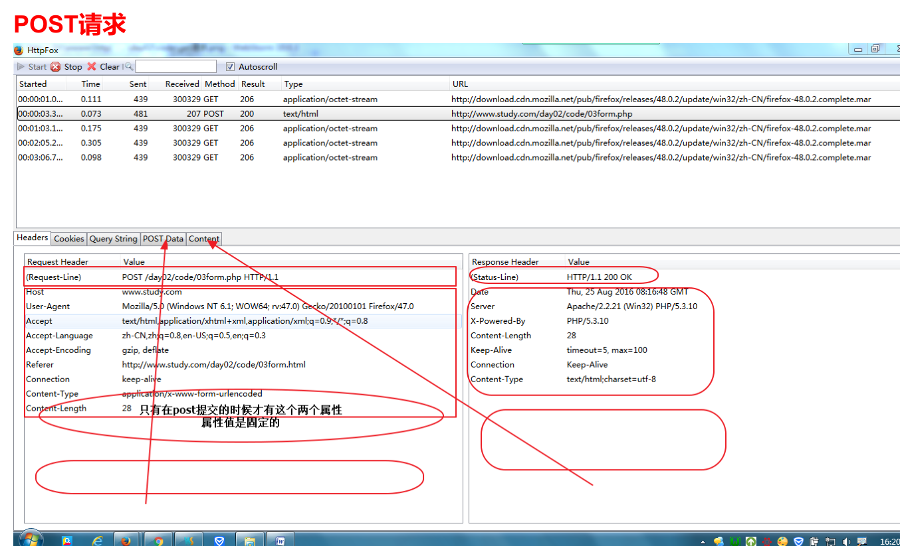

# 英语单词
- constant 常量
- client 客户端
- server 服务器
- browser 浏览器
- get 获取
- post 发送、邮寄
- define 定义
- syntax 语法
- error 报错
- domain 区域
- load 载入
- module 模块
- load module 载入模块
- add type 添加类型
- time zone 时区
- document root 根目录
- global 全局
- define 定义
- notice 警告
- line 第几行
- range 范围
- merge 合并
- split 拆分
- array 数组
- right 右边
- index 索引
- random 随机数
- join 连接
- exit 退出
- insert 插入
- delete 删除
- update 更新
- database(db)数据库
- detail 详情
- list 列表
- edit 编辑
- connect 连接
- index 索引
- fetch 获取
- query 查询
- redirect 跳转
- empty 空
- interval 整数
- float 浮点数、小数
- double 浮点数、小数
- decimal 小数
- print 打印
- association 关联
- context 上下文环境
- retrive 获取
- create 创建
- drop 销毁，放弃
- cookie 馅饼
- session 会话
- ascend 升序
- descend 降序

# day01
## 学习目标
- 能够说出访问网址时请求与响应的流程
- 能够说出什么是ip、dns、端口
- 能够安装并使用apache服务器
- 能够说出索引数组和关联数组的区别
- 能够声明和调用自定义函数
- 综合案例：**水果列表案例**

## 这一阶段课程的作用
### 摘要
- 以前学习的技术回顾及局限性
- 动态网站开发
- 客户端请求，服务端处理并响应，引入php和ajax
### 总结
1. 我们平时写代码怎么打开网页的
2. 浏览器的作用理解：把html解析成人类可以看的有格式的内容
3. 平时上网的时候是怎么打开网站上的网页的
4. 上网的时候打开的网页代码是放在哪里的? --> 服务器 --> 怎么理解服务器，平时有没有见过服务器
    + 水果店里有很多种水果，苹果，桔子，香蕉...
    + 客户想要桔子，他向服务员说明自己的需求
    + 店员从店里找到对应的桔子，然后给客户
5. 网站流程图v1.0
6. 如果当前的这个html引入了js,css，则是怎么请求的 --> 网站流程图v2.0
7.0 我们平时其实上网其实并不在乎一个网站是美还是丑，比如12306虽然丑，但我们离不开，比如淘宝，我们天天逛，因为对我们来说，最重要的其实是商品，是数据
7. 淘宝、京东、百度网页是不是写死的? ---> 如何理解***动态***这二个字(通过代码来演示) --> 网站流程图v3.0
    + 动态不是指的有轮播图、有选项卡这些特效，动态指的是***数据是动态的***
    + https://www.baidu.com/s?wd=java
    + 动态网页指的是网页是用像php这样的写的，有if..else,for之类的条件、循环语句，把执行后的结果返回给客户端
8. 服务器的作用
9. php的作用
10. ajax这又是另一个话题了，二个陌生的概念一起理解会搞混，这块大家忽略掉，后面讲到了再理解

```php
<?php
header('content-type:text/html;charset=utf8;');
$arr = [
    ["id"=>1,"title"=>"第一篇新闻",'content'=>"第一篇新闻的内容"],
    ["id"=>2,"title"=>"第二篇新闻","content"=>"第二篇新闻的内容"],
    ["id"=>3,"title"=>"第三篇新闻","content"=>"第三篇新闻的内容"],
    ["id"=>4,"title"=>"第四篇新闻","content"=>"第四篇新闻的内容"],
    ["id"=>5,"title"=>"第五篇新闻","content"=>"第五篇新闻的内容"],
    ["id"=>6,"title"=>"第六篇新闻","content"=>"第六篇新闻的内容"]
];
($id = $_GET['id']) or ($id = 1);
// print_r($arr[$id-1]);
?>
<!DOCTYPE html>
<html lang="en">
<head>
    <meta charset="UTF-8">
    <meta name="viewport" content="width=device-width, initial-scale=1.0">
    <meta http-equiv="X-UA-Compatible" content="ie=edge">
    <title>Document</title>
</head>
<body>
    <?php if(empty($arr[$id-1])){?>
        <h1>访问的内容不存在</h1>
    <?php }else{?>
        <h1><?php echo $arr[$id-1]["title"];?></h1>
        <p><?php echo $arr[$id-1]["content"];?></p>
    <?php } ?>
</body>
</html>
```

## 我们为什么要学习php以及这块课程的安排
### 摘要
- 为什么要学习php
- 我们将学习哪些东西
### 总结
- 为什么要学习php
    + 能够理解整个网站的开发体系，当网站出了问题的时候，能够快速的知道出了什么问题
    + 更好的与后端进行交流
    + 为了后面的ajax课程的学习
- 这块课程的安排
    + 搭建服务器和运行php的环境软件(apache+php)
    + 服务器端开发(php语法及应用)
    + http协议(理论)
    + 数据库(mysql)
    + ajax
- 课程定位
    + php(不影响找工作，学习比较吃力的同学这块能学会多少算多少，后面找工作之前的复习时间不要用来复习这块)
    + ajax(重点，需要所有人掌握)

## 服务器的理解
### 摘要
- 什么是服务器
- 普通电脑安装提供web服务的软件，就可以作为服务器
- 凡是需要联网才能使用的软件，都要用到服务器
### 总结
- 常见的服务器有哪些
    + 商店
    + 餐馆
    + 游戏服务器
    + 百度云服务器
    + hydra
    + 传智播客
    + 网吧上网网管的电脑扣钱系统
    + apache

## C/S、B/S架构
### 摘要
- 概念
- 优缺点分析
- 具体说明哪些是C/S，哪些是B/S
### 总结
- 常见的C/S架构
    + 微信客户端
    + 网游客户端
    + hydra
    + qq
    + 迅雷
    + 百度云
    + foxmail
- 常见的B/S架构
    + 微信网页版
    + 页游
    + 博学谷
    + 邮箱网页版

## 网络基本概念-ip、域名、dns
### 摘要
- ip地址
- 127.0.0.1本机回环地址
- 域名、localhost、DNS、购买域名
- ipconfig命令
- DNS起到了什么作用，DNS也是服务器，专门进行域名解析，真正请求时仍然是访问的ip地址
### 总结
- ip --> 江夏区高新区光谷大道77号光谷金融港B15栋2层
- 域名 --> 武汉传智播客
- dns --> 百度地图
- 网站流程图v4.0(加入dns)
- 需要记住的知识点
    + localhost --> 我当前电脑上的服务器
    + 127.0.0.1 --> 同上

## 网络基本概念-hosts文件、端口
### 摘要
- 只有以管理员权限运行的编辑器才有权限修改hosts文件
- 端口：ip地址像小区地址，端口像门牌号，范围:0到65535(2的16次方-1)
- netstat -an 查看当前占用的端口号，也就是对应的门牌号的房间有没有住着人，端口号不能冲突了，不同服务使用不同端口号，网页服务端口是80和443,数据库mysql端口号是3306,提供数据库服务
### 总结
- 网站流程图v5.0(加入hosts)
- 如何找hosts文件
    + win+r --> drivers
    + 进入etc文件
- 修改hosts文件有可能会出现用管理员权限重试 --> 解决办法
- 测试hosts文件
- 端口的理解
    + 一个商场有很多的商店 --> 光知道ip地址是不够的 --> 还需要知道门牌号 --> 端口就是门牌号
- 检测80端口是否被占用
    + netstat -an

## url组成
### 摘要
- url参数介绍,url的组成部分
### 总结
+ 协议+域名(ip)+端口+端口+目录路径+文件名+查询参数+锚点
+ http://baidu.com:80/a/b/c.php?a=1&b=2#aa(可以打开百度地址举例)

## 安装phpStudy
- 如果安装失败 --> 附件中有两个版本，都试一下 --> 是否缺少vc库（主要见于win7,win8系统）
- 运行phpStudy时，有时候会弹出一个类似错误一个的东西，关掉不影响使用就行，不用管
- 安装的目录一定不要有中文
- 红、绿的含义

## phpStudy的基本使用
- 默认访问文件设置 => 其他选项 --> phpStudy设置--> 端口常规设置
- 域名默认会定位到网站的根目录
- 开启目录访问 => 其他选项 --> phpStudy设置 --> 允许目录列表
- 一个最基本的php代码
    1. 在根目录创建一个php为扩展名的文件(文件名一定不要是中文，不支持中文)
    2. <?php ?>
    3. echo "hello world";
- 引言：为什么会有虚拟主机

## 配置第一个虚拟主机
1. 其他选项 --> 站点域名管理
2. 网站域名、网站目录、第二目录、网站端口
3. 新增
4. 保存
5. 修改vhost文件
6. 修改hosts文件
7. 重启apache

## 配置第二个虚拟主机
- phpStudy的bug，修改第二个会影响之前配置的虚拟主机，使第一个虚拟主机无法加载目录结构

## apache与php的关系
### 摘要
- apache和php是分开的，apache负责提供网页服务，而php负责解析php代码 
- apache还可以和java搭配使用
- phpStudy集成了apache,mysql,php,也可以独立安装这三个软件，只不过特别麻烦(有时候要一整天的折腾)
### 总结
- apache就是服务器软件，光有apache没有php只能实现静态网页服务器
    + 测试=>httpd.conf中的`Include conf/extra/httpd-php.conf`注释掉，测试之前写的php文件-->修改了配置文件，一定要重启phpStudy，否则不能生效
- php是用来做动态网页的，可以把我们写的php代码(里面会有if...else,for,while逻辑代码)解析成html代码
- 补充：怎么理解phpStudy这个软件 --> 全家桶、套餐
    + 真正的数据存放于mysql数据库当中
    + php的另一大作用补充：接收用户提交的表单数据   
    + 从服务器、php、数据库的角度来理解增
        1. 用户填写好表单
        2. 点击submit提交
        3. php接收数据
        4. 把接收到的数据保存到mysql数据库当中
    + 从服务器、php、数据库的角度来理解删(比如购物车中的商品的删)
    + 从服务器、php、数据库的角度来理解改(购物车中商品的数量修改)
    + 从服务器、php、数据库的角度来理解查(查询商品信息)

## 动态网页的基本实现原理
- 13、14两种视频一起放
### 摘要
### 总结
- 案例一：把视频中讲解的例子用代码实现出来(先模仿，不要理解为什么)
    + ["11","22","33"]这个数组渲染成html列表
    + 注意事项
        1、从现在开始，一定不要双击打开html页面
        2、不要使用webstorm右上角图标点击打开网页
        3、只能通过在地址栏输入网址的方式打开网页
        4、语句结束一定要加上分号，否则会报错
- 案例二：时间代码(先模仿，不要理解为什么)

```php
<?php
$arr = ["11","22","33"];
?>
<!DOCTYPE html>
<html lang="en">
<head>
    <meta charset="UTF-8">
    <meta name="viewport" content="width=device-width, initial-scale=1.0">
    <meta http-equiv="X-UA-Compatible" content="ie=edge">
    <title>Document</title>
</head>
<body>
    <ul>
        <?php for($i=0;$i<=2;$i++){?>
        <li><?php echo $arr[$i];?></li>
        <?php } ?>
    </ul>
</body>
</html>
```

```php
<!DOCTYPE html>
<html lang="en">
<head>
    <meta charset="UTF-8">
    <meta name="viewport" content="width=device-width, initial-scale=1.0">
    <meta http-equiv="X-UA-Compatible" content="ie=edge">
    <title>Document</title>
</head>
<body>
    <?php 
        echo date('Y-m-d');
    ?>
</body>
</html>
```
## php输出方式和php混编方式
### 摘要
- php的返回结果会按照浏览器的解析规则来展示
- php将结果返回给浏览器，浏览器按照html的解析规划进行解析
- echo 
- print_r
- var_dump
### 总结
- 打印输出的几种方式(print不要记，不用)
    + echo 输出字符串、数字
    + print_r 输出数组
    + var_dump 输出null,布尔型,判断数据的类型(不要用echo打印布尔型)
- 混写
    + php代码要在<?php ?>里面，外面的算html的内容
    + 练习if..else
    + 练习if...endif,if...else...endif
### 练习
- 声明一个$age,判断如果年龄大于18岁，显示h1标题：您已成年，否则显示您未成年

## php中的注释和变量
### 摘要
- 单行注释
- 多行注释
- 变量的声明，默认值是null
- 视频中变量没有赋值直接打印没有报错，如果我们也想不出现notice报错，设置php.ini配置文件,error_reporting=E_ALL&~E_NOTICE 意思是报告所有的错误，但除了E_NOTICE这一种。这也是最常用的错误报告级别，它不会报告注意类（如：使用了未定义的变量）的错误。修改完了一定要重启phpStudy
### 总结
- 注释方式和js一样
- 变量命名规范和js一样(不同点：爱钱)
- 没有var,第一次算定义，第二次算赋值

## 变量的几个相关函数
- isset：判断变量是否存在，判断变量是否定义了，同时它还可以判断变量的值是否为null
- empty：判断变量是否为空，为空的值有:"",0,"0","0.0",false,[]
- unset：删除变量

```php
echo $a;//会报错
```

```php
//可以改写成
if (isset($a)) {
    echo $a;
}
```

```php
$arr = [];
for($i=0;$i<100;$i++){
    echo $arr[$i];
}
```

```php
//可以改写成
$arr = [];
if(!empty($arr)){
    for ($i = 0; $i < 100; $i++) {
        echo $arr[$i];
    }
}
```

```php
$a = 100;
echo $a;
unset($a);
echo $a;
```

## 数据类型-字符串
- php中的数据类型
    + 基本数据类型：string,int,float,boolean
    + 复合数据类型：array,object(不讲，我们的课程没有涉及到php的面向对象相关知识点，我们将来在学习ES6的时候会学习到ES6中的js的构造函数类的写法，和php大体上是一致的，到时候学到了可以再自己去查一下php的面向对象相关知识点)
    + 特殊数据类型：null,资源(后面会学习到)
- 判断数据类型
    + is_string
    + is_bool
    + is_int
    + is_float
    + is_array
    + is_object
- php中的点号连接符
    + 理解为什么在php数组中并不存在.length这样求长度
    + count函数引入

## 单引号与双引号的区别
- 双引号可以识别字符串中的变量名
- 如果需要将变量名独立，避免解析错误，可以加上{}
- php支持转义(`\$|\r|\n|\t`)
- 如果想要解析，一定要保证***最外层加双引号***
- 双引号可以解析变量内容，双引号里面的单引号也是可以解析出来的


## 作业及补充
- 配置虚拟主机
    + day8.com www.day8.com
    + day9.com www.day9.com
- 参考《流程图练习.png》自己把流程图画出来理解今天讲的这些概念
- 代码分割
    + br
    + hr
    + pre标签
- 讲解header头避免中文乱码
- 讲解vscode如何创建代码片段(快速生成header这一行代码)
- vscode-goto-document用法
- 把今天的代码自己写一遍
    + 动态打印获取时间
    + 条件判断php、html混编
    + 循环php,html混编
- 如果第一天比较ok的话，可以把第二天的前面4个视频上完

# day02

## 学习目标
- 能够说出索引数组与关联数组的区别
- 能够声明和调用自定义函数
- 综合案例**水果列表案例**

## 复习
- 概念层面
- 配置层面
- 代码层面

## php中数组的创建和遍历
- 索引数组
- $arr = array(1,2,3);
- $arr = [1,2,3];
- count($arr)获取数组的长度
- 关联数组$arr = array($key=>$value,$key=>$value)
- 数组的打印print_r,var_dump
- 遍历关联数组 foreach(数组 as 键=>值)
- 遍历关联数组简洁语法 foreach(数组 as 值)

## php数组的补充说明
- 为什么要使用pre标签的使用
- 混合数组的索引问题(忽略)
- 通过[]创建数组和添加值(有点类似js中的push)
- 数组相关的函数
    + count
    + unset(不推荐使用)
    + 如下的代码会补充五个函数：in_array,array_slice,array_splice,die,exit

### 练习代码

```php
//说出如下的代码的打印结果
header('content-type:text/html;charset=utf-8');
$arr1 = [1,2,3,4];
var_dump(in_array(3, $arr1));
```

```php
//说出如下的代码的打印结果
header('content-type:text/html;charset=utf-8');
$i = 0;
while($i<100){
    $i++;
    $arr[] = $i;
}
print_r($arr);
```

```php
//说出如下代码的打印结果
header('content-type:text/html;charset=utf-8');
$arr1 = [1,2,3,4];
$arr2 = array_slice($arr1,2);
print_r($arr2);
```

```php
//说出如下的代码的打印结果
header('content-type:text/html;charset=utf-8');
$arr1 = [1,2,3,4];
$arr2 = array_splice($arr1,2,1);
print_r($arr2);
print_r($arr1);
```

## 二维数组
- 练习使用foreach嵌套

## 数据类型转换和运算符介绍
- 强制类型转换，$num = (int)$str;
- 隐式类型转换 $num = $str + 0;
- 需要记住的规则
    + true类型转换成数字为1，false为0
    + null转换为数字0
    + []转换为数字为0
    + 当字符串转换为整型或浮点型时，如果字符串是以数字开头的，就会先把数字部分转换为整型，在舍去后面的字符串；如果数字中含有小数点，则会取到小数前一位。

```php
//说出如下代码的值
echo 1 + 'abc';
echo 0+'123aaa';
echo 1 + '5.53string';
echo 5 + '-4string';
echo 1 + true;
echo 1 + false;
echo 1.5 + true;
echo 1 + null;
```

## php中的条件判断、循环语法
- http://php.net/manual/zh/language.basic-syntax.phpmode.php
    + 凡是在一对开始和结束标记之外的内容都会被 PHP 解析器忽略，这使得 PHP 文件可以具备混合内容。 可以使 PHP 嵌入到 HTML 文档中去
    + 当 PHP 解释器碰到 ?> 结束标记时就简单地将其后内容原样输出（除非马上紧接换行 - 见指令分隔符）直到碰到下一个开始标记；例外是处于条件语句中间时，此时 PHP 解释器会根据条件判断来决定哪些输出，哪些跳过。
    + if,endif
    + for,endfor
    + else if和elseif在php中都是ok的，但是如果用的是冒号方法进行混编，则只能用elseif,否则算语法错误(参考http://www.php.net/manual/zh/control-structures.elseif.php)


### 练习
- 水果案例练习(两种方式都要写一遍)
    + 用for来实现
    + 用foreach来实现

```php
//已知我们有如下的数组：
$data = [
    ["id" => 1, "name" => "香蕉", "src" => "img/banana1.jpg"],
    ["id" => 2, "name" => "苹果", "src" => "img/apple1.jpg"],
    ["id" => 3, "name" => "橙子", "src" => "img/orange1.jpg"],
    ["id" => 4, "name" => "菠萝", "src" => "img/pineapple1.jpg"]
];
//静态页面见：code\fruit_demo\demo_01
//现要求渲染成真正的用户可以看到的动态数据列表
```

```php
//用for来实现的参考答案
<?php 
header('content-type:text/html;charset=utf-8');
$data = [
    ["id" => 1, "name" => "香蕉", "src" => "img/banana1.jpg"],
    ["id" => 2, "name" => "苹果", "src" => "img/apple1.jpg"],
    ["id" => 3, "name" => "橙子", "src" => "img/orange1.jpg"],
    ["id" => 4, "name" => "菠萝", "src" => "img/pineapple1.jpg"]
]
?>

<!DOCTYPE html>
<html lang="en">
<head>
    <meta charset="UTF-8">
    <meta name="viewport" content="width=device-width, initial-scale=1.0">
    <meta http-equiv="X-UA-Compatible" content="ie=edge">
    <title>Document</title>
    <link rel="stylesheet" href="./style.css">
</head>
<body>
    <div class="header">
        传智网上水果超市
    </div>
    <div class="container">
        <p>
            <a href="javascript:;">水果</a>
            <a href="javascript:;">干果</a>
            <a href="javascript:;">蔬菜</a>
        </p>
        <ul>
            <?php if(count($data)>0){?>
                <?php for($i=0;$i<count($data);$i++){?>
                    <li>
                        " alt="">
                        <a href="#"><?php echo $data[$i]['name'];?></a>
                    </li>
                <?php } ?>
            <?php }else{?>
                <li>
                    暂无数据
                </li>
            <?php } ?>
        </ul>
    </div>
    <div class="footer">
        传智播客 版权所有
    </div>
</body>
</html>
```

```php
//用foreach实现的参考答案
<?php 
header('content-type:text/html;charset=utf-8');
$data = [
    ["id" => 1, "name" => "香蕉", "src" => "img/banana1.jpg"],
    ["id" => 2, "name" => "苹果", "src" => "img/apple1.jpg"],
    ["id" => 3, "name" => "橙子", "src" => "img/orange1.jpg"],
    ["id" => 4, "name" => "菠萝", "src" => "img/pineapple1.jpg"]
]
?>

<!DOCTYPE html>
<html lang="en">
<head>
    <meta charset="UTF-8">
    <meta name="viewport" content="width=device-width, initial-scale=1.0">
    <meta http-equiv="X-UA-Compatible" content="ie=edge">
    <title>Document</title>
    <link rel="stylesheet" href="./style.css">
</head>
<body>
    <div class="header">
        传智网上水果超市
    </div>
    <div class="container">
        <p>
            <a href="javascript:;">水果</a>
            <a href="javascript:;">干果</a>
            <a href="javascript:;">蔬菜</a>
        </p>
        <ul>
            <?php if(count($data)>0){?>
                <?php foreach($data as $value){?>
                    <li>
                        " alt="">
                        <a href="#"><?php echo $value['name']; ?></a>
                    </li>
                <?php } ?>
            <?php }else{?>
                <li>
                    暂无数据
                </li>
            <?php } ?>    
        </ul>
    </div>
    <div class="footer">
        传智播客 版权所有
    </div>
</body>
</html>
```

## php中函数的声明和使用特点
- 函数声明方式和js基本一致
- php中函数内部无法访问函数外部成员(理解技巧：没有作用域链)
- 使用global来引用全局变量(不推荐这样玩，因为代码比较多的情况下会让人理解错误，不知道到底是局部变量还是全局变量，推荐按下一个视频方式来玩)   

### 参考代码 

```php
//求1到100的和
header('content-type:text/html;charset=utf-8');
$num = 100;
$sum = 0;
for($i=0;$i<=100;$i++){
    $sum += $i;
}
echo $sum;
```

```php
header('content-type:text/html;charset=utf-8');
function cal($num){
    $sum = 0;
    for($i=0;$i<=$num;$i++){
        $sum+=$i;
    }
    return $sum;
}
$num = 100;
echo cal($num);
```

```php
//这个代码不会得到正确的答案
header('content-type:text/html;charset=utf-8');
$num = 100;
function cal(){
    $sum = 0;
    for($i=0;$i<=$num;$i++){
        $sum+=$i;
    }
    return $sum;
}
echo cal($num);
```

```php
//思考如下的代码的结果是多少
header('content-type:text/html;charset=utf-8');
$num = 100;
function cal(){
    global $num;
    echo $num;//结果多少
    $num = 20;
    echo $num;//结果多少
}
cal();
echo $num;//结果多少
```


## 超全局变量
- $GLOBALS保存了所有全局变量，可以使用它来访问全局变量
    + $GLOBALS有点类似js中的window对象，后面用$GLOBALS用得多一些
- $_SERVER 获取服务器端相关信息
- $_REQUEST 获取提交参数
- $_GET 获取GET提交参数
- $_POST 获取POST提交参数
- $_FILES获取上传文件
- $_ENV 获取操作环境变量
- $_COOKIE 操作COOKIE
- $_SESSION 操作SESSION

```php
header('content-type:text/html;charset=utf-8');
$a = 100;
echo $GLOBALS['a'];//值多少
echo '<br>';
$GLOBALS['b'] = 200;
function fn(){
    echo $GLOBALS['a'];//值多少
    echo '<br>';
    echo $GLOBALS['b'];//值多少
    echo '<br>';
    $GLOBALS['c'] = 300;
    echo '<br>';
}
fn();
echo $GLOBALS['c'];//值多少
```

## 常量的定义和使用
- define('PI',3.14159,false)//false表示大小写敏感，默认是false
- 魔术常量
    + __LINE__
    + __FILE__
    + __DIR__
    + __FUNCTION__

```php
echo __LINE__;//获取当前行数
echo '<hr>';
echo __FILE__;//获取当前文件的路径
echo '<hr>';
echo __DIR__;//获取当前文件所在的目录
echo '<hr>';
function test(){
    echo __FUNCTION__;//获取当前函数的函数名
}
test();
```

- 补充：预定义常量
    + PHP_VERSION
    + PHP_INT_MAX

## 文件载入
- include
- require
- include_once
- require_once

## 字符串相关函数
- strlen
- mb_strlen(multibyte)
- mb_internal_encoding(忽略，用不上) 获取当前php环境的默认编码，通过这个方法也可以设置默认编码 mb_internal_encoding('utf-8')

### 补充
- trim
- explode
- implode
- strpos
- strrpos
- strchr
- strrchr

```php
$str = " abc ";
echo mb_strlen($str);
echo '<hr>';
$str1 = trim($str);
echo mb_strlen($str1);
```

```php
$str = "a|b|c";
$arr = explode('|',$str);
print_r($arr);
```

```php
$arr = ["a","b","c"];
$str = implode('|',$arr);
echo $str;
```

```php
$str = "abcd";
$index1 = strpos($str,'c');
var_dump($index1);
echo '<hr>';
$index2 = strpos($str,'e');
var_dump($index2);
```

```php
$str = "acbcd";
$index1 = strrpos($str,'c');
var_dump($index1);
echo '<hr>';
$index2 = strrpos($str,'e');
var_dump($index2);
```


```php
$str = "a.d.c.b.d";
$index = strrpos($str,'.');
echo substr($str,$index);
```

```php
//这个函数没有用，是为了引出下面这个函数
$str = "a.d.c.b.d";
echo strchr($str,'.');
```

```php
$str = "a.d.c.b.d";
echo strrchr($str,'.');
```

## 时间处理函数
- 注意事项：php时间单位是秒，js单位是毫秒
- time()时间戳
- date('Y-m-d H:i:s') 修改时区，需要修改配置文件 date.timezone = PRC|Asia/shanghai
    + 东八区
- strtotime能够将时间转换成时间戳

## 补充函数
- max
- min
- ceil
- floor
- uniqid，基于微秒计的当前时间，一般用于生成唯一的id，类似身份证
- rand
    + rand(1000,9999)的含义 [1000,9999]
- parse_url
- array_slice
- array_splice

```php
$url = 'http://www.baidu.com:80/path?a=1&b=2#anchor';
print_r(parse_url($url));
```


### 练习
- 打印24小时以后的时间戳
    + time() + 24 * 60 * 60
- 打印一周以后的时间戳
    + time() + 7 * 24 * 60 * 60
- 打印明天这个时间的时间格式
    + date('Y-m-d H:i:s',strtotime('+1 day'))

## 文件操作函数
- file_get_contents:读取文件内容，可以读取二进制文件，如果读取成功，返回文件内容，否则返回false
- 设置响应头content-type:image/jpeg,可以展示图片内容
- file_put_contents(文件路径,文件内容,是否追加),默认覆盖原始内容，第三个参数控制是否追加，FILE_APPEND属于系统预定义的常量，表示文件末尾追加，具体的值是一个整数

## php回顾
- php标记 <?php ?>
- echo,print_r,var_dump
- 字符串
- 单引号与双引号
- 数组、索引数组、关联数组、混合数组、二维数组、数组遍历
- 变量作用域
- 常量定义和使用define
- 载入文件 include require include_once require_once
- 常用内置函数
    + 字符串相关
        1. strlen
        + mb_strlen
        + trim
        + strpos
        + strrpos
        + strrchr
        + explode
        + implode
    + 时间相关
        + date
        + time
        + strtotime
    + 文件相关
        + file_get_contents
        + file_put_contents

## 水果案例
- 演示最终的效果(在视频前体验一下)，通过效果思考制作的思路(final.php)
    1. 列表这块我们之前做过了同样的demo --> 把一个数组循环渲染成列表
    2. 详情页使用的数据和列表页是一样的 --> 必须把索引数组数据单独提取到一个公共的文件当中
    3. 将来这个案例还需要实现对水果的删除、编辑的功能 ---> 涉及到对数据文件的文件读写
    4. 为了便于不懂php的同事的使用，我们可以用一般的数据格式来表示数据(如下所示)
    5. 思考：如何把如下的数据转换成数组????

```
1|img/banana1.jpg|香蕉
2|img/apple1.jpg|苹果
3|img/orange1.jpg|橘子
4|img/pineapple1.jpg|菠萝
5|img/mango1.jpg|芒果
6|img/grape1.jpg|葡萄
7|img/pomelo1.jpg|柚子
8|img/pawpaw1.jpg|木瓜
9|img/kivi1.jpg|猕猴桃
10|img/persimmon1.jpg|柿子
11|img/lemon1.jpg|柠檬
12|img/pomegranate1.jpg|石榴
13|img/pear1.jpg|梨
14|img/strawberry1.jpg|草莓
15|img/blueberry1.jpg|蓝莓
16|img/waxberry1.jpg|杨莓
17|img/peach1.jpg|桃
18|img/coconut1.jpg|椰子
19|img/apricot1.jpg|杏
20|img/cherry1.jpg|樱桃
```

- 14-水果案例-基本实现思路.avi
- 15-在php文件中根据数据动态生成水果列表.avi
- 16-使用explode函数拆分字符串并生成对应结构.avi
- 17-完成水果列表案例.avi
- 思路整理
    1. 学会数据建模
        + 看到一组列表 --> 索引数组
        + 看到一个东西的各方面描述 --> 关联数组
    2. "\n"必须用双引号，否则不能解析

## 作业及补充（答案及思路见WORD笔记第81页晚上任务）
1、把后天的当前时间打印出来
2、打印1-100的偶数(提示：用循环+条件判断来实现)
3、封装加减乘除取余的函数，提取到公共的php文件当中，在当前文件中使用这几个函数
4、列表一下之前学过的表单控件(h5_input_type.html)
    + input[type="text"]
    + input[type="radio"]
    + input[type="checkbox"]
    + textarea
    + select
    + input[type="file"]
    + input[type="date"]
    + 参考：http://www.runoob.com/tags/att-input-type.html

# day03
## 每日目标
- 能够进行服务器端渲染操作
- 能够说出GET和POST请求方式的区别
- 能够在服务器端分别接收GET、POST的请求参数
- 能够处理复选按钮的请求参数
- 能够进行文件上传并使用$_FILES处理
- 综合案例:**能够完成注册案例**

## get和post的介绍
### 摘要
- 学习目标介绍
- get请求、获取数据都是get请求
    + src
    + href
    + 地址栏直接输地址
- get提交数据的方式
- post请求的特点，传参与get的区别
### 总结
- 客户端向服务器传递数据有两种方式
    + get的方式
    + post的方式
    + 通过代码演示一下(这块马上会学，了解即可)
- get和post两种方式的特点
    + get传递数据只能是4kb,不安全(明信片)，历史记录里可以看得到的
    + post传递数据没有限制(默认为8M,可以调大)，比较安全(物流快递包裹)，在header里面可以看到，关掉页面就没了
- get的应用
    + https://www.baidu.com/s?wd=关键字
    + 第一天讲的例子再看一次
- post的应用
    + 第一天讲的表单例子再看一次


## get请求方式的特点
### 摘要
- form表单的action,method
- 将数据提交给当前页面 01-form-get.php
- 必须给input标签设置name属性
- 超全局变量$_GET,$_POST
- 使用$_GET接收get提交的参数
### 总结
- href,直接在地址栏输入网址,表单提交默认,表单提交主动设置method为get的时候，可以追加参数，参数能够被后台通过$_GET所接收

## get请求方式的应用-水果案例详情页
- 思路
    1. 修改主页面a标签链接,跳转到商品详情页
    2. 在商品详情页接收get参数
    3. 读取fruit.txt文件，获取水果相关的数据
    4. 遍历水果数据，判断水果id是否和get参数的id一致，如果一致，保存水果数据
    5. 把水果数据填充到对应的html页面中
- getList.php+detail.php

## post请求方式的使用说明
- $_SERVER判断请求是否是post类型，如果是，则打印$_POST获取参数
- $_SERVER['REQUEST_METHOD']
- 补充说明(必讲)
    + 了解性知识：$_REQUEST可以同时打印$_GET,$_POST数据，但不建议使用，有可能会名字相同造成覆盖
        1. http://php.net/manual/zh/ini.core.php#ini.request-order
        2. This directive describes the order in which PHP registers GET, POST and Cookie variables into the _REQUEST array. Registration is done from left to right, newer values override older values.
    + 直接进入水果详情页没有带参数的时候会报错，如何修复
        1. $_SERVER['REQUEST_METHOD']
        2. isset判断变量、数组的键是否存在

## 几种表单元素收集数据方式的说明
- $_SERVER['PHP_SELF']可以获取当前文件路径 -- 可以忽略，因为不写也是一样的
- 复选框获取值的方式
- 下拉列表值如果不设置，默认会找option的innerText

## 文件上传的基本实现
- 在看视频之前，可以用最简单的代码把文件上传做出来，先不要管一些细节问题
- enctype属性 ---> 我们传递给后台的数据被以什么形式进行编码
    + 默认application/x-www-form-urlencoded 键值对形式编码
    + 如果是文件上传，上传的是一个文件，没办法并且不能通过键值对的形式上传
- 使用multipart/form-data multipart指的是多种形式的意思
- inut[type=”file”]
- move_uploaded_file
- 这个案例讲得了一堆的细节，大家听听就好，没有人记得住的，做好笔记和示例代码，后面用得上的话，直接抄过去就行了

## 文件上传的补充1 - 判断各种出现错误的情况
- 错误代码 - http://php.net/manual/zh/features.file-upload.errors.php
- empty判断用户是否上传文件
- if(strpos($type,"image/")===0)必须要为三个等于号
    + 如果找不到值为false
    + false隐式类型转换和0比较为true
- 允许用户上传的文件扩展名，为表单元素添加属性accept=".jpg,.png"

## 文件上传的补充2 -- 防止文件上传过大
- upload_max_filesize默认为2M，在php.ini中可以修改
- 服务器对每一次post请求传递的数据做了限制，默认为8mb,可以在php.ini配置文件中修改post_max_size属性值

## 文件上传的补充3 -- 多文件上传

## 注册案例 - 上
0. 在学习视频之前，先把整个效果查看一下
    + 回忆水果案例的思路
        1. 把数据放在一个txt文件当中
        2. 使用文件读写来读入，使用explode来转换成真正的数组
    + 我们这个注册案例应该是刚好反过来的，一开始有一个txt，里面存了一堆的同学的信息
    + 点击注册的时候，把新添加的同学的信息写入这个txt当中 ---> implode
2. (这块建议大家忽略，先把逻辑功能做出来再考虑这些细节，一开始考虑这么多没必要)获取提交的用户名，对用户名数据进行验证，是否isset,是否是空串
3. return语法，如果在php结构中直接写return,那么当运行到return代码的时候，整个php文件的执行就结束了，php后面的html代码也不会加载，但是如果写在函数中，就不会受到影响
4. trim方法去掉空格

## 注册案例 - 下
1. implode，用指定字符串对数据进行合并，与explode作用相反
2. 判断文件是否上传成功，error!=0表示上传失败
3. 把生成的随机文件名写入到$_POST数组中
4. file_put_content写文件，注意加换行符

## 晚上要讲的案例
+ 写一个表单来测试GET和POST提交方法的区别，并输出其结果。
    1. 表单元素要求有：用户名、密码、重复密码、性别(单选)、爱好(复选框)、学历(下拉列表)、个人介绍(文本域)等。
+ 把明天要讲的案例用现有学习的知识做出来
    1. 先实现列表页，把list.html修改为list.php
    2. 数据建模
        - 标题 title
        - 歌手 singer
        - 专辑 album
        - 音乐 src
        - id
    3. 构建数组

```php
<?php 
header('content-type:text/html;charset=utf-8');
$musicArr = [
    ["id"=>1,"title"=>"王五之歌1","singer"=>"王五","album"=>"王五的歌","src"=> "./mp3/See You Again.mp3"],
    ["id"=>2,"title"=>"王五之歌2","singer"=>"王五","album"=>"王五的歌","src"=> "./mp3/See You Again.mp3"],
    ["id"=>3,"title"=>"王五之歌3","singer"=>"王五","album"=>"王五的歌","src"=> "./mp3/See You Again.mp3"],
    ["id"=>4,"title"=>"王五之歌4","singer"=>"王五","album"=>"王五的歌","src"=> "./mp3/See You Again.mp3"]
]
?>
<!DOCTYPE html>
<html lang="en">

<head>
    <meta charset="UTF-8">
    <title>Document</title>
    <link rel="stylesheet" href="bootstrap.css">
</head>

<body>
    <div class="container">
        <h1 class="text-center display-3 py-3">音乐列表</h1>
        <hr>
        <a href="./upload.php" class="btn btn-dark">新增歌曲信息</a>
        <table class="table table-bordered">
            <thead class="thead-inverse">
                <tr>
                    <th>标题</th>
                    <th>歌手</th>
                    <th>专辑</th>
                    <th>音乐</th>
                    <th>操作</th>
                </tr>
            </thead>
            <tbody>
                <tr>
                    <td>王五之歌</td>
                    <td>王五</td>
                    <td>王五的歌</td>
                    <td>
                        <audio src="./mp3/See You Again.mp3" controls></audio>
                    </td>
                    <td>
                        <a href="#" class="btn btn-primary">编辑</a>
                        <a href="#" class="btn btn-danger">删除</a>
                    </td>
                </tr>
                <tr>
                    <td>王五之歌</td>
                    <td>王五</td>
                    <td>王五的歌</td>
                    <td>
                        <audio src="./mp3/See You Again.mp3" controls></audio>
                    </td>
                    <td>
                        <a href="#" class="btn btn-primary">编辑</a>
                        <a href="#" class="btn btn-danger">删除</a>
                    </td>
                </tr>
                <tr>
                    <td>王五之歌</td>
                    <td>王五</td>
                    <td>王五的歌</td>
                    <td>
                        <audio src="./mp3/See You Again.mp3" controls></audio>
                    </td>
                    <td>
                        <a href="#" class="btn btn-primary">编辑</a>
                        <a href="#" class="btn btn-danger">删除</a>
                    </td>
                </tr>
                <tr>
                    <td>王五之歌</td>
                    <td>王五</td>
                    <td>王五的歌</td>
                    <td>
                        <audio src="./mp3/See You Again.mp3" controls></audio>
                    </td>
                    <td>
                        <a href="#" class="btn btn-primary">编辑</a>
                        <a href="#" class="btn btn-danger">删除</a>
                    </td>
                </tr>
                <tr>
                    <td>王五之歌</td>
                    <td>王五</td>
                    <td>王五的歌</td>
                    <td>
                        <audio src="./mp3/See You Again.mp3" controls></audio>
                    </td>
                    <td>
                        <a href="#" class="btn btn-primary">编辑</a>
                        <a href="#" class="btn btn-danger">删除</a>
                    </td>
                </tr>
                <tr>
                    <td>王五之歌</td>
                    <td>王五</td>
                    <td>王五的歌</td>
                    <td>
                        <audio src="./mp3/See You Again.mp3" controls></audio>
                    </td>
                    <td>
                        <a href="#" class="btn btn-primary">编辑</a>
                        <a href="#" class="btn btn-danger">删除</a>
                    </td>
                </tr>
            </tbody>
        </table>
    </div>
</body>

</html>
```
    4. 动态渲染列表数据

```php
<?php 
header('content-type:text/html;charset=utf-8');
$musicArr = [
    ["id"=>1,"title"=>"王五之歌1","singer"=>"王五","album"=>"王五的歌","src"=> "./mp3/See You Again.mp3"],
    ["id"=>2,"title"=>"王五之歌2","singer"=>"王五","album"=>"王五的歌","src"=> "./mp3/See You Again.mp3"],
    ["id"=>3,"title"=>"王五之歌3","singer"=>"王五","album"=>"王五的歌","src"=> "./mp3/See You Again.mp3"],
    ["id"=>4,"title"=>"王五之歌4","singer"=>"王五","album"=>"王五的歌","src"=> "./mp3/See You Again.mp3"]
]
?>
<!DOCTYPE html>
<html lang="en">

<head>
    <meta charset="UTF-8">
    <title>Document</title>
    <link rel="stylesheet" href="bootstrap.css">
</head>

<body>
    <div class="container">
        <h1 class="text-center display-3 py-3">音乐列表</h1>
        <hr>
        <a href="./upload.php" class="btn btn-dark">新增歌曲信息</a>
        <table class="table table-bordered">
            <thead class="thead-inverse">
                <tr>
                    <th>标题</th>
                    <th>歌手</th>
                    <th>专辑</th>
                    <th>音乐</th>
                    <th>操作</th>
                </tr>
            </thead>
            <tbody>
                <?php foreach ($musicArr as $key => $value) {?>
                <tr>
                    <td><?php echo $value['title'];?></td>
                    <td><?php echo $value['singer']; ?></td>
                    <td><?php echo $value['album']; ?></td>
                    <td>
                        <audio src="<?php echo $value['src']; ?>" controls></audio>
                    </td>
                    <td>
                        <a href="#" class="btn btn-primary">编辑</a>
                        <a href="#" class="btn btn-danger">删除</a>
                    </td>
                </tr>
                <?php } ?>
            </tbody>
        </table>
    </div>
</body>

</html>
```

    5. 把数组提取出去，用txt文本数据格式来表示

```
1|王五之歌1|王五|王五的歌|./mp3/See You Again.mp3
2|王五之歌2|王五|王五的歌|./mp3/See You Again.mp3
3|王五之歌3|王五|王五的歌|./mp3/See You Again.mp3
4|王五之歌4|王五|王五的歌|./mp3/See You Again.mp3
5|王五之歌5|王五|王五的歌|./mp3/See You Again.mp3
6|王五之歌6|王五|王五的歌|./mp3/See You Again.mp3
```


```php
<?php 
header('content-type:text/html;charset=utf-8');
$data = file_get_contents('./data.txt');
$arr1 = explode("\n",$data);
$musicArr = [];
foreach ($arr1 as $key => $value) {
    $musicArr[] = explode('|',$value);
}
?>
<!DOCTYPE html>
<html lang="en">

<head>
    <meta charset="UTF-8">
    <title>Document</title>
    <link rel="stylesheet" href="bootstrap.css">
</head>

<body>
    <div class="container">
        <h1 class="text-center display-3 py-3">音乐列表</h1>
        <hr>
        <a href="./upload.php" class="btn btn-dark">新增歌曲信息</a>
        <table class="table table-bordered">
            <thead class="thead-inverse">
                <tr>
                    <th>标题</th>
                    <th>歌手</th>
                    <th>专辑</th>
                    <th>音乐</th>
                    <th>操作</th>
                </tr>
            </thead>
            <tbody>
                <?php foreach ($musicArr as $key => $value) {?>
                <tr>
                    <td><?php echo $value[1];?></td>
                    <td><?php echo $value[2]; ?></td>
                    <td><?php echo $value[3]; ?></td>
                    <td>
                        <audio src="<?php echo $value[4]; ?>" controls></audio>
                    </td>
                    <td>
                        <a href="#" class="btn btn-primary">编辑</a>
                        <a href="#" class="btn btn-danger">删除</a>
                    </td>
                </tr>
                <?php } ?>
            </tbody>
        </table>
    </div>
</body>

</html>
```

    6. 增加功能(upload.html -> upload.php)

```php
<?php
header('content-type:text/html;charset=utf-8');
if(!empty($_POST)){
    // print_r($_POST);
    // print_r($_FILES);
    $data = file_get_contents('./data.txt');
    $arr1 = explode("\n", $data);
    $musicArr = [];
    foreach ($arr1 as $key => $value) {
        $musicArr[] = explode('|', $value);
    }
    $file = $_FILES['source'];
    if(!($file['error'] == 0)){
        echo '音乐上传出错';
        echo '<script>setTimeout(function(){location.href="./upload.php"},1000)</script>';
        die();
    }
    $fileName = './mp3/'.rand(10000,99999).time().strrchr($file['name'],'.');
    $res = move_uploaded_file($file['tmp_name'], $fileName);
    if ($res) {
        $arr2 = [count($musicArr), $_POST['title'], $_POST['geshou'], $_POST['zhuanji'], $fileName];
        $musicArr[] = $arr2;
        foreach ($musicArr as $key => $value) {
            $arr3[] = implode('|',$value);     
        }
        // print_r($arr3);
        // echo implode("\n",$arr3);
        $res = file_put_contents('./data.txt',implode("\n",$arr3));
        if($res){
            echo "<script>location.href='./list.php'</script>";
        }
    }
    
}
?>
<!DOCTYPE html>

<html lang="en">

<head>
    <meta charset="UTF-8">
    <title>Document</title>
    <link rel="stylesheet" href="bootstrap.css">
    <style>
        .showInfo {
            display: block;
        }
    </style>
</head>

<body>
    <div class="container">
        <h1 class=" display-3 py-3">音乐上传</h1>
        <hr>
        <!-- 表单结构： -->
        <form action="./upload.php" method="POST" enctype="multipart/form-data">
            <div class="form-group">
                <label for="title">标题</label>
                <!-- 下面的所有 is-invalid 均为要判断的类名 -->
                <input type="text" class="form-control" id="title" name="title">
                <!-- in_array("title",$errorArr):判断当前$errorArr有没有title这个值，如果有返回true -->
                <small class="invalid-feedback ">这是一个标题</small>
            </div>
            <div class="form-group">
                <label for="geshou">歌手</label>
                <input type="text" class="form-control" id="geshou" name="geshou">
                <small class="invalid-feedback ">歌手的名称</small>
            </div>
            <div class="form-group">
                <label for="zhuanji">专辑</label>
                <input type="text" class="form-control" id="zhuanji" name="zhuanji">
                <small class="invalid-feedback ">专辑名称</small>
            </div>
            <div class="form-group">
                <label for="source">资源文件</label>
                <!-- accept 用于设置可以接受的文件类型，可以使用MIMEtype,也可以使用后缀名，使用逗号连接 -->
                <input type="file" class="form-control" id="source" name="source" accept=".mp3">
                <small class="invalid-feedback ">文件上传</small>
            </div>
            <button class="btn btn-primary btn-block">上传</button>
        </form>
    </div>
</body>

</html>
```

    7. 删除
        - 修改list.php --> `<a href="del.php?id=<?php echo $value[0];?>" class="btn btn-danger">删除</a>`
        - 添加del.php

```php
<?php 
header('content-type:text/html;charset=utf-8');
// print_r($_GET);
$arr1 = explode("\n", file_get_contents('./data.txt'));
foreach ($arr1 as $key => $value) {
    $musicArr[] =  explode('|',$value);
}
// print_r($musicArr);
for($i=0;$i<count($musicArr);$i++){
    if($_GET['id'] == $musicArr[$i][0]){
        array_splice($musicArr,$i);
        foreach ($musicArr as $key => $value) {
            $arr2[] = implode('|',$value);
        }
        file_put_contents('./data.txt',implode("\n",$arr2));
        echo '<script>location.href="./list.php"</script>';
        break;
    }
}
?>
```

    8. 显示编辑(如果前面的掌握得好，可以做，如果不是很理解，需要自己写代码了，这块就不讲了)
    
```php
<?php 
header('content-type:text/html;charset=utf-8');
$arr1 = explode("\n", file_get_contents('./data.txt'));
foreach ($arr1 as $key => $value) {
	$musicArr[] = explode('|', $value);
}
//显示编辑页面
foreach ($musicArr as $key => $value) {
    if ($value[0] == $_GET['id']) {
        $myArr = $value;
        break;
    }
}

?>
<!DOCTYPE html>

<html lang="en">

<head>
	<meta charset="UTF-8">
	<title>Document</title>
	<link rel="stylesheet" href="bootstrap.css">
	<style>
		.showInfo {
			display: block;
		}
	</style>
</head>

<body>
	<div class="container">
		<h1 class=" display-3 py-3">编辑</h1>
		<hr>
		<!-- 表单结构： -->
		<form method="post" enctype="multipart/form-data">
			<input type="hidden" name="id" value="<?php echo $myArr[0] ?>">
			<div class="form-group">
				<label for="title">标题</label>
				<input type="text" class="form-control" id="title" name="title" value="<?php echo $myArr[1] ?>">
				<small class="invalid-feedback">这是一个标题</small>
			</div>
			<div class="form-group">
				<label for="geshou">歌手</label>
				<input type="text" class="form-control" id="geshou" name="geshou" value="<?php echo $myArr[2] ?>">
				<small class="invalid-feedback">歌手的名称</small>
			</div>
			<div class="form-group">
				<label for="zhuanji">专辑</label>
				<input type="text" class="form-control" id="zhuanji" name="zhuanji" value="<?php echo $myArr[3] ?>">
				<small class="invalid-feedback">专辑名称</small>
			</div>
			<div class="form-group">
				<label for="source">资源文件</label>
				<!-- accept 用于设置可以接受的文件类型，可以使用MIMEtype,也可以使用后缀名，使用逗号连接 -->
				<input type="file" class="form-control" id="source" name="source" accept=".mp3">
				<small class="invalid-feedback">文件上传</small>
			</div>
			<button class="btn btn-primary btn-block">保存</button>
		</form>
	</div>
</body>

</html>
```

    9. 处理编辑

```php
<?php 
header('content-type:text/html;charset=utf-8');
$arr1 = explode("\n", file_get_contents('./data.txt'));
foreach ($arr1 as $key => $value) {
	$musicArr[] = explode('|', $value);
}
if($_SERVER['REQUEST_METHOD'] == 'GET'){
	//显示编辑页面
	foreach ($musicArr as $key => $value) {
		if ($value[0] == $_GET['id']) {
			$myArr = $value;
			break;
		}
	}
}else{
	//处理编辑信息
	// die;
	for($i=0;$i<count($musicArr);$i++){
		if($musicArr[$i][0] == $_POST['id']){
			$file = $_FILES['source'];
			$tempArr = [$_POST['id'], $_POST['title'], $_POST['geshou'], $_POST['zhuanji']];			
			if($file['error'] == 0){
				//有上传新的音乐
				$fileName = './mp3/'.rand(10000,99999).time().strrchr($file['name'],'.');
				$res = move_uploaded_file($file['tmp_name'],$fileName);
				if($res){
					$tempArr[] = $fileName;
				}else{
					$tempArr[] = $musicArr[$i][4];
				}
				$musicArr[$i] = $tempArr;
				foreach ($musicArr as $key => $value) {
					$arr2[] = implode('|',$value);
				}
				$res = file_put_contents('./data.txt',implode("\n",$arr2));
				if($res){
					echo "<script>location.href='./list.php'</script>";
				}else{
					echo "<script>location.href='./edit.php'</script>";
				}
			}else{
				$tempArr[] = $musicArr[$i][4];
				$musicArr[$i] = $tempArr;
				foreach ($musicArr as $key => $value) {
					$arr2[] = implode('|', $value);
				}
				$res = file_put_contents('./data.txt', implode("\n", $arr2));
				if ($res) {
					echo "<script>location.href='./list.php'</script>";
				} else {
					echo "<script>location.href='./edit.php'</script>";
				}
			}

		} 
	}
}
?>
<!DOCTYPE html>

<html lang="en">

<head>
	<meta charset="UTF-8">
	<title>Document</title>
	<link rel="stylesheet" href="bootstrap.css">
	<style>
		.showInfo {
			display: block;
		}
	</style>
</head>

<body>
	<div class="container">
		<h1 class=" display-3 py-3">编辑</h1>
		<hr>
		<!-- 表单结构： -->
		<form method="post" enctype="multipart/form-data">
			<input type="hidden" name="id" value="<?php echo $myArr[0] ?>">
			<div class="form-group">
				<label for="title">标题</label>
				<input type="text" class="form-control" id="title" name="title" value="<?php echo $myArr[1] ?>">
				<small class="invalid-feedback">这是一个标题</small>
			</div>
			<div class="form-group">
				<label for="geshou">歌手</label>
				<input type="text" class="form-control" id="geshou" name="geshou" value="<?php echo $myArr[2] ?>">
				<small class="invalid-feedback">歌手的名称</small>
			</div>
			<div class="form-group">
				<label for="zhuanji">专辑</label>
				<input type="text" class="form-control" id="zhuanji" name="zhuanji" value="<?php echo $myArr[3] ?>">
				<small class="invalid-feedback">专辑名称</small>
			</div>
			<div class="form-group">
				<label for="source">资源文件</label>
				<!-- accept 用于设置可以接受的文件类型，可以使用MIMEtype,也可以使用后缀名，使用逗号连接 -->
				<input type="file" class="form-control" id="source" name="source" accept=".mp3">
				<small class="invalid-feedback">文件上传</small>
			</div>
			<button class="btn btn-primary btn-block">保存</button>
		</form>
	</div>
</body>

</html>
```

# day04
## 学习目标
- 综合案例:**音乐列表**
- 能够说出任意三个常见的请求头以及函数
- 能够说出响应报文的组成
- 能够识别常见的状态码以及含义

## 音乐案例的基本功能展示
- 当前课程介绍
- 音乐列表案例功能演示，上传音乐，展示音乐列表，表单校验，编辑，删除
- audio标签播放音乐

## 简单介绍json文件的创建方法和语法特点
- 使用json保存数据
- json数据格式的特点

### 练习
- 描述笔记本的各方面的信息(object)
- 描述水果数据(array)

## 使用json格式描述歌曲列表数据并实现php的相关操作
- 使用json描述音乐数据
- json_decode($data,true),参数2表示是否将{}转换为数组，true表示优先转为数组，默认会转换为对象
- json_encode
- json中不能写注释

## 歌曲列表数据的动态展示
- 读取json数据，展示歌曲列表
- 和水果案例对比，体验使用json存储数据的遍历

## 新增操作-实现用户数据业务的分析
- 和昨天的注册案例类似

## 完成用户数据的验证及错误信息提示

## 完成歌曲新增操作

## 实现删除操作

## 编辑操作-显示默认数据

## 编辑操作-用户输入数据验证(上)

## 编辑操作-用户输入数据验证(下)
- break应该写在if里面，这块视频里写错了

## 完成编辑操作

## http协议简介
- 如何理解协议这二个字
    + 协议就是约定
    + 两个宿舍楼，说话听不到，用电筒进行交流如何交流
    + 约定好：如果XXX，则客户端就知道了，原来这是一个html文件，如果XXX，则客户端就知道了，原来这是一个图片,如果XXX，则客户端知道了，这是一个utf8的文件
- 三次握手
    1. 客户端向服务器发送一个连接请求
    2. 服务器向客户端返回一个确认信息
    3. 客户端将请求及这个确认信息发送到服务器
- 约定内容
    + 请求/响应报文格式
    + 请求方式 - GET/POST
    + 响应状态 - 200/404/302
    + 预设的请求/响应头

## 请求报文的内容
- 请求行、请求头、请求体
- fiddler可以抓取请求报文和内容(这块用firefox,chrome的network替代来看)


## 响应报文的内容

## 请求报文和响应报文的应用
- header('content-type:text/css')
- 重定向 header('location:./01-form-get.php')
- 重定向 header('refresh:2;url=./01-form-get.php')
- 下载文件(了解即可)
    + header('content-type:application/octet-stream')
    + 实现自动下载，同时可以设置下载后的文件名称
    + header('content-disposition:attachment;filename=temp.php')
- 防盗链
    + getallheaders()获取所有的请求头信息
        1. 通过referer字段，拿到请求源地址
        2. parse_url()解析请求源地址，获取域名
        3. 对域名进行判断

## 晚上的任务
- 把音乐案例重新做一遍
- 安装google插件:editThisCookie


# day05
## 学习目标
- 掌握在服务器端操作cookie的方式
- 掌握在服务器端操作session的方式
- 能够说出cookie与session的关系与区别
- 能够完成登录案例
- 能够使用SQL语句对表进行增删改查操作
- 能够使用数据库可视化工具对表进行增删改查操作

## 通过登录案例引出我们要讲的知识点

## http是无状态的
- 会话：打电话，在没挂断电话之前这个阶段叫会话
- 如何理解无状态
- 实现记录和保持状态的技术有：cookie,session
    + 用卖早餐的例子来理解cookie,session

## cookie的实现原理说明
- cookie传输流程图
- cookie就类似在游泳馆办的打的卡，卡是商场发给用户的，以后用户再来游，都会带着卡来，在卡上打一个洞

## 在php中创建cookie并再次体会cookie的实现的原理
- setcookie


## setcookie函数的参数说明
- 设置cookie的有效期 setcookie('username','jack',time()+10),截止日期，单位是秒
- 设置永久有效期setcookie('username','jack',PHP_INT_MAX),PHP_INT_MAX大概是68年，从1970年开始算的话大概20年后过期，并不完全永久，PHP_INT_MAX分平台，以上是按32位系统算的，虽然目前电脑是64位，但phpStudy仍然按32位程序运行，如果是64位的话，max值会非常大，近似永久
- 通过path设置访问权限setcookie('username','jack',PHP_INT_MAX,'/')
- 设置域名访问权限，了解即可(多个二级域名之间可以共享)

## cookie的删除
- 方式一：设置有效时间为过去的时间 `setcookie('uName','admin',time()-1)`
- 方式二：将cookie中的值设置为false或空字符串`setcookie('uName',false)`或setcookie('uName',"")
- 方式三：不设置值setcookie('uName')
- 在浏览器自己清掉
- 注意：即使cookie的键名完全一致，但只要设置的参数不同，浏览器就会认为是两个不同的cookie
- cookie的缺点：
    + 只能存字符中
    + 只能存4kb左右
    + 不太安全（用户可以自己修改掉进行伪造）

## 登录案例
1. 表单校验处理，由于只有两个输入框，所以统一在一处提示错误信息
2. 精准提示用户名不存在还是密码错误
3. 如果登录成功，向客户端写入cookie,isLogin=true
4. 跳转到主页面
5. 在主页面通过$_COOKIE读取isLogin,如果未登录，就调到登录页面
6. 退出功能实现：删除cookie,跳到登录页
7. 分析问题：目前的逻辑，只要客户端传入了一个isLogin=true的cookie,服务器就认为登录了，很不安全，就类似你拿了一张隔壁商场的会员卡，来柜台要求打折，柜台不验证会员卡的真伪就进行打折

## session的基本介绍
- session基本概念：用户信息保存在浏览器端不安全，可以放在session中
- 流程图介绍session的应用场景，服务端生成sessionid返回给客户端
- 注意：cookie是客户端概念，session是服务器端概念

## session值的设置及实现原理的回顾
- php默认不开启session
- session_start()开启session,生成sessionid,并在服务器端创建一个文件来存储内容(phpStudy/PHPTutorial/tmp/tpm),开启session后，会默认将sessionid写入到浏览器的cookie中
- 自动开启session(了解即可，不建议)，session.auto_start=1,php.ini
- 重点观察开启session之后，session_id的传输过程

## 使用session改造登录案例
- 销毁session(unset)
- session与cookie的对比
- 使用了session的文件，都必须使用session_start开启session

区别 | cookie | session
---------|----------|---------
 存储位置 | 浏览器 | 服务器
 浏览器携带的数据量 | 多 | 少(只携带session_id)
 存储的数据类型 | 字符串 |任意类型
 安全性 | 较低 | 较高
 默认的有效路径 | 当前路径及其子路径 | 全站有效
 数据的传输量 | 4kb,不能超过20个 | 无限制

## 数据库的基本概念
- 感性理解（见数据库学习笔记.doc）
    + 通过excel来学习数据库相关的概念
- 通过phpStudy打开mysql命令行窗口，默认密码是root
- show databases
- create database mybase
- use mybase
- show tables
- create table mytable(id int,name varchar(20),age int)
- desc mytable
- drop table mytable
- 以上命令，只做简单了解，重点是使用可视化工具来操作数据库

## navicat工具
- varchar可变长度
- char固定长度
- int
- tinyint

datetime是保存的日期
是否为null
默认值
字符串需要用引号包起来

## 查询语句

## 增加、删除、修改语句的说明

## 补充几个统计函数
- count,count(*)
- max/min
- avg平均值

```sql
select count(*) from mytable;
select count(id) from mytable;
select count(age) from mytable;
select max(age) from mytable;
select min(age) from mytable;
select max(name) from mytable;
select min(name) from mytable;
select avg(age) from mytable;
select avg(name) from mytable;
```

## limit,order by
- order by ,desc,asc
- 分页

```sql
select * from mytable order by id desc;
select * from mytable order by name;
select * from mytalbe limit 5;
select * from mytable order by id desc limit 3;
select * from mytable limit 3 order by id desc;
select * from mytable limit 2,4;
select * from mytable limit 4 offset 2;
init pagesize = 10;
int pageCount = 1;
select * from mytable limit pageSize offset (pageCount - 1) * pageSize;
select * from mytable limit pageSize offset (pageCount - 1) * pageSize;
select * from mytable limit pageSize offset (pageCount - 1) * pageSize;
```

## 多表查询的实现
- select * from student,class where student.cid = class.classid
- select * from student inner join class on student.cid = class.classid
- left join
- right join
- 备注：这里面学的数据库知识还不够，后面会在做阿里百秀项目之前补充一些知识点，这里就学习这么多，避免大家晕掉

## 晚上的任务
- 重做登录案例
- 数据库知识点总结

# day06
## 学习目标
- 能够使用php连接mysql数据库
- 能够使用php对mysql进行查询操作
- 能够使用php检测非查询操作的受影响行数
- 能够断开与数据库的连接
- 综合案例：能够完成用户管理案例

## 引言
- 正如我们自己也可以手动用鼠标来操作文本文件，但是要想做成自动化的，我们需要借助于php的file_get_contents,file_put_contents
- 我们不能用鼠标来玩navicat，也需要使用php来操作mysql

## php中建立数据库连接
- 这个视频录制得有问题，从15:34到16:02没声音
- $conn = mysqli_connect('localhost','root','root','mybase')
- die
- 解决乱码问题(mysqli_set_charset($conn,'utf8'))

## php中执行增加修改和删除操作
- mysqli_query
- mysqli_error
- mysqli_affected_rows判断受影响的行数

## php中查询结果集(上)
- mysqli_query($conn,"set names utf-8")设置编码的另一种方式
- mysqli_num_rows($result)返回当前的查询结果集返回的行数
- utf8,utf-8二种方式都是ok的

## php中查询结果集(下)
- mysqli_fetch_array(很少用)
- mysqli_fetch_assoc(用得最多)
- mysqli_fetch_array(基本上不会用)，返回的内容的形式（MYSQL_ASSOC|MYSQL_NUM|MYSQL_BOTH）

## php操作数据库的回顾
1. 如何创建连接
2. 设置编码
3. 创建sql语句，注意字符串要加引号
4. 执行sql语句 mysqli_query
5. 接收返回值mysqli_fetch_array,mysqli_fetch_assoc

## 操作简易封装
- 连接数量是有限的
- mysqli_close($conn)
- 封装

```
mysql> show variables like '%max_connections%';
+-----------------+-------+
| Variable_name   | Value |
+-----------------+-------+
| max_connections | 512   |
+-----------------+-------+
1 row in set (0.01 sec)
```

```php
/**
 * opt 封装增加、删除、修改操作
 * @param mixed $sql 
 * @return mixed 
 */
function opt($sql){
    //创建连接，如果成功就返回连接对象（资源），如果失败就返回false
    $conn = mysqli_connect('localhost','root','root','mybase');
    //判断连接是否成功
    if(!$conn){
        die('连接失败');
    }
    //设置编码
    mysqli_set_charset($conn,'utf8');
    //执行sql语句，接收返回值，对于增加删除而言，mysqli_query返回true/false 
    $res = mysqli_query($conn,$sql);
    //及时关闭连接
    mysqli_close($conn);
    //返回
    return $res;
}

/**
 * select封装查询操作
 * @param mixed $sql 
 * @return mixed 
 */
function select($sql){
    //创建连接，如果成功就返回连接对象（资源），如果失败就返回false
    $conn = mysqli_connect('localhost','root','root','mybase');
    //判断连接是否成功
    if(!$conn){
        die('连接失败');
    }
    //设置编码
    mysqli_set_charset($conn,'utf8');
    //查询语句的返回值,如果成功就返回资源（结果集），如果失败就返回false
    $res = mysqli_query($conn,$sql);
    if(!$res){
        echo '查询失败';
    }else if(mysqli_num_rows($res) == 0){//有结果集但是没有数据行
        echo '没有查询到数据';
    }else{
        //有结果集也有数据行
        while($arr = mysqli_fetch_assoc($res)){
            $result[] = $arr;
        }
        mysqli_close($conn);
        return $result;
    }
    mysqli_close($conn);
}
```


## 用户管理案例-项目介绍和数据表的创建
- 案例介绍
- 数据库设计、创建表userinfo
- 给表中添加假数据

## 首页数据的动态展示(上)
- 封装一个方法，专门处理数据库的访问逻辑，类似第6个视频
- 查询数据，如果出错了后需要在页面显示错误信息，注意用td包裹
- 封装的方法需要返回错误信息，为了保证数据库能正常关闭，需要调整相关代码

## 首页数据的动态展示(下)
- 遍历数据展示用户信息
- 计算用户年龄 strtotime转为时间戳，当前的时间戳-生日时间戳就是年龄，向上取整ceil


## 新增操作-实现数据验证
- 5：56-6：05中间没有说话
- 表单校验，错误提示，和之前的思路类似
- 视频中错误，$GLOBALS['error']不能用count来计算数量，可以去掉

## 新增操作-实现新增

## 删除实现

## 编辑操作-展示默认数据

## 编辑操作-验证用户数据
- 类似音乐案例
## 编辑操作-实现数据更新


# day07

## 为什么需要ajax
0. 这块前面几个视频讲得有点绕，这块忽略掉视频中的讲解，我换一种讲法 ---> 
1. 调整网络为3g slow
2. 观察之前我们做过的案例，发现 ---> 白屏很严重，同时发现，如果页面的头部、尾部、左侧导航之类的哪怕是一模一样的，在切换的过程当中需要重新请求新的数据，数据传输浪费
3. 找几处ajax用到的案例
    + https://beauty.vip.com
    + http://tieba.baidu.com/p/5704055973
    + http://huaban.com
    + http://sh.jumei.com
    + https://www.bilibili.com/video/av21556388?from=search&seid=14533231970211118374
    http://reg.email.163.com/unireg/call.do?cmd=register.entrance&from=126mail
    + http://m.manmanbuy.com/guoneizhekou.aspx
    + http://music.163.com/#/share/31193205/507701291
4. ajax的作用
    + Asynchronous Javascript And XML不用理英文，但需要记住如下的二个单词
        - async 异步的意思
        - sync 同步的意思
    + ajax是一门改善用户体验的技术，使用它可以实现在不更新整个网页的情况下，通过js异步的从后台获取需要更新的部分的数据，使用DOM拼接之类的技术更新这一部分的数据(后面会学习什么是异步，这块先可以忽略掉这个词汇)
    + 结合https://beauty.vip.com这个网站，通过观察network让大家理解这句话的含义
5. 写一个helloworld的demo来了解ajax的相关性的代码（先不考虑具体的细节之类的，感性的认识即可，原理性的东西后面的视频会进行讲解的）
    + 大家练习一下代码

## 如何理解异步
- 直接用ajax代码来理解
- 看完实现操作的例子之后，用比喻再理解

## 使用异步对象发送get请求


